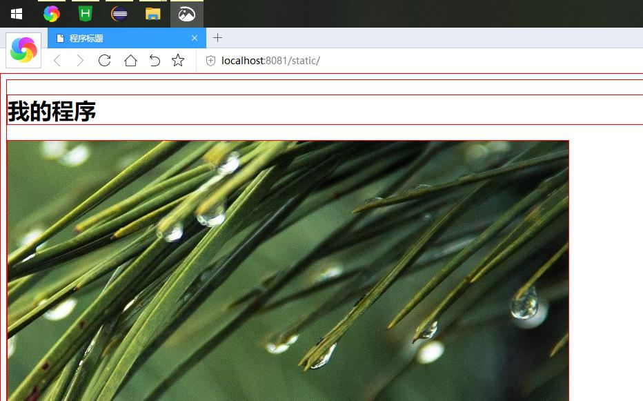
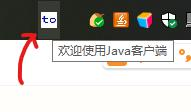

# 简介
本项目可以让java拥有编写客户端的能力。我们都知道，Java自带的AWT和Swing不仅难用，还很丑。
很少有人喜欢用它们。于是我萌生了使用HTML作为客户端的想法，于是诞生了这个项目。本项目是一个框架。

# 效果
 
 ### 示例程序界面
 程序界面用HTML编写，通过HTTP协议与Java进行交互。


### 托盘提示


### 托盘菜单

可以自定义托盘图标和托盘菜单。实现想要实现的功能。


# 快速使用

+ 在github `Release`界面下载最近的版本：`jclient.jar`
+ 导入Jar包到程序中
+ 写入以下代码：

```java
	public static void main(String[] args) throws IOException, AWTException {
		Server server = new Server(8081);
		server.start();
	}
```

注意：服务默认`根目录`是`程序的运行目录`。在eclipse中即`.classpath`文件所在目录。其它开发环境可能有所不同。静态目录是`"/static/"`且不可改变。
请把程序界面入口命名为`index.html` 放入静态目录中。

# 基本功能

### 添加路由

Http的请求参数、请求头部、输入流、输出流等等都是通过HttpExchange操作的

```java
	server.addContext("/", new Handler(null) {
		@Override
		public void handle(HttpExchange arg0) {
			OutputStream os = arg0.getResponseBody();
			try {
				os.write("欢迎访问本页面".getBytes("utf-8"));
			} catch (UnsupportedEncodingException e) {
			} catch (IOException e) {
			}
		}
	});
```

### 显示程序界面
```java
	server.show()
```

### 退出程序
```java
	server.close()
```


# 个性化


### 托盘提示文本

```java
	server.setToolTip("提示内容");
```

### 托盘提示图标

```java
	Image image = Toolkit.getDefaultToolkit().createImage("icon.jpg");
	server.setIcon(image);
```

### 托盘菜单

```java
	PopupMenu menu = new PopupMenu();
	menu.add(new MenuItem("菜单项一"));
	server.setMenu(menu);
```

### 自定义托盘
设置此项后，setToolTip、setIcon、setMenu将失效
```java
	TrayIcon icon = new TrayIcon(image, "提示")
	server.setTray(icon);
```

### 服务根目录
可以是绝对路径或相对路径，但是必须以`/`结束
```java
	server.setRoot("app/");
```


